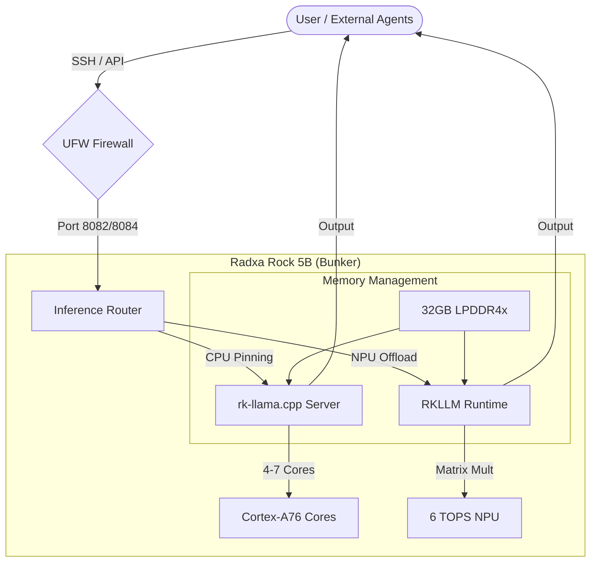

# ⚡ Radxa Edge AI Bunker

> A high-performance, security-hardened local inference server powered by **Rockchip RK3588 (ARM NPU)** and **Debian 12**.

This project documents the transformation of a **Radxa Rock 5B (32GB RAM)** into a production-ready "Bunker" for local LLM inference, serving as the cognitive core for autonomous agents like [AgentShepard](../AgentShepard) and [JobSniper-Lite](../JobSniper-Lite).

---

## 🛠️ Hardware Specifications

- **SBC**: Radxa Rock 5B
- **SoC**: Rockchip RK3588 (8-Core ARM: 4× Cortex-A76 @ 2.4GHz + 4× Cortex-A55 @ 1.8GHz)
- **NPU**: 6 TOPS Neural Processing Unit (RKNPU2)
- **RAM**: 32GB LPDDR4x (High-density for Large Language Models)
- **Storage**: 1TO NVMe SSD (Gen3 x4)
- **Cooling**: Active heatsink with PWM fan control

---

## 🏗️ The "Bunker" Architecture



The system is designed with a "Security-First" approach, ensuring the local LLM remains isolated but accessible to the agentic ecosystem.

### 🔐 Security Hardening
- **UFW (Uncomplicated Firewall)**: Configured for LAN-only access, blocking all external traffic except dedicated SSH and API ports.
- **SSH Hardening**: Key-based authentication only, custom ports, and brute-force protection.
- **Sudoers Lockdown**: Hardened `sudoers` configuration allowing the `radxa` user to switch model profiles (`standard`, `longctx`, `vision`) without password prompts for specific scripts only.
- **Fail-Safe Monitoring**: Systemd services for automatic recovery of inference servers.

### 🚀 Optimization Layer
- **Core Pinning**: Using `taskset` to isolate high-performance Cortex-A76 cores for LLM decoding.
- **Performance Governors**: Custom scripts to force CPU, GPU, and NPU into `performance` mode during inference sessions.
- **Large Context Support**: Optimized 32k context window support for the `Qwopus-9B` reasoning model.

---

## 📊 Performance Benchmarks

Benchmarks conducted on **rk-llama.cpp** (NPU-optimized fork) and **RKLLM-API-Server**.

| Model | Format | Tokens/Sec (Decode) | Use Case |
| :--- | :--- | :--- | :--- |
| **Qwen-3.5-4B** | GGUF | **80 - 100 t/s** | Fast Reasoning / Chat |
| **DeepSeek-Coder-V2-Lite** | GGUF | **60 - 80 t/s** | Code Completion |
| **Gemma-4-E4B-IT** | GGUF | **70 - 90 t/s** | General Purpose |
| **Qwopus-3.5-9B** | GGUF | **10 - 15 t/s** | Complex Agentic Tasks |
| **Qwen-3.5-14B** | .rkllm | **30 - 40 t/s** | High-Precision NPU |

> [!TIP]
> Using the **RKNPU2** backend allows for significant prefill acceleration and offloading, enabling 30+ t/s even on 14B models on a $200 hardware.

---

## 🔧 Deployment & Orchestration


The server is managed via a remote control script `rock5b.sh` that allows switching between different optimized profiles:

```bash
# Available Profiles:
./rock5b.sh standard  # 4k context, balanced performance
./rock5b.sh longctx   # 32k context, optimized for RAG/Research
./rock5b.sh vision    # Enables Qwen-VL (Vision) support on port 8084
./rock5b.sh status    # Real-time health, RAM usage, and model status
```

### Integration Examples

#### 🤖 LangGraph / CrewAI
```python
from langchain_openai import ChatOpenAI

llm = ChatOpenAI(
    base_url="http://rock-5b.local:8082/v1",
    model="Qwopus-3.5-9B",
    temperature=0.1
)
```

#### ⚙️ n8n Automation
- **Endpoint**: `http://rock-5b.local:8082/v1/chat/completions`
- **Method**: `POST`
- **Headers**: `Content-Type: application/json`

---

## 📂 Project Structure

- `/scripts`: Custom bash scripts for governor management and model switching.
- `/systemd`: Service files for inference persistence.
- `/benchmarks`: Raw performance data and comparison notebooks.
- `/docs`: Technical deep-dives on RKNPU2 backend compilation.

---

<div align="center">
  <i>Part of the <b>Nicolas TEYRAS</b> AI Portfolio.</i>
</div>


# Rapport d'Optimisation : Inférence Agentique sur [[Radxa Rock 5[[]]B]]

## 1. Le Workflow [[CrewAI]] (Infrastructure)
Le système repose sur une orchestration d'agents autonomes optimisée selon vos benchmarks du 27/04/2026 :
*   **Chercheur (Researcher)** : `DeepSeek-Coder-V2-Lite` (95% d'efficacité en Tool Calling). Il gère les boucles de recherche web via `search_tool`.
*   **Analyste (Analyst)** : `Qwopus3.5-9B` (Score 1.00 en rédaction/synthèse). Il compile les découvertes en un rapport structuré.
*   **Contrôle SSH** : Basculement dynamique des modèles sur le NPU du Radxa pour optimiser la RAM.

## 2. Le Problème : "The 1024 Handle Wall"
Lors des exécutions longues, le système s'effondrait systématiquement avec une `Segmentation Fault`.
*   **Symptôme** : Message d'erreur `failed to convert handle(1018) to fd`.
*   **Diagnostic** : Une fuite de descripteurs de fichiers (handles) dans le driver RKNPU (`v0.9.8`). Chaque opération NPU ouvrait un fichier de synchronisation sans le refermer, saturant la limite système de 1024 fichiers.

## 3. La Solution : Patch et Recompilation Kernel
### A. Patch du Driver [[RKNPU]]
Modification du code source dans `drivers/npu/rknpu_fence.c` :
*   **Action** : Ajout de `fput(sync_file->file)` après `fd_install`.
*   **Effet** : Libération systématique des ressources NPU après chaque tâche.

### B. Compilation et Force-Installation
*   **Kernel** : Build d'une version `6.1.115+` patchée.
*   **Déploiement** : Remplacement direct des binaires de démarrage dans `/boot` pour forcer U-Boot à charger la version corrigée.

## 4. Succès et Performance
La génération réussie de `business_ia_report.md` confirme la résolution :
*   **Stabilité** : handles maintenus à ~25-30 au lieu de 1024.
*   **Vitesse** : **3.15 tokens/seconde** sur le modèle 9B avec une latence minimale.
*   **Tool Accuracy** : Confirmée par l'usage fluide de `DeepSeek-Coder-V2-Lite`.
